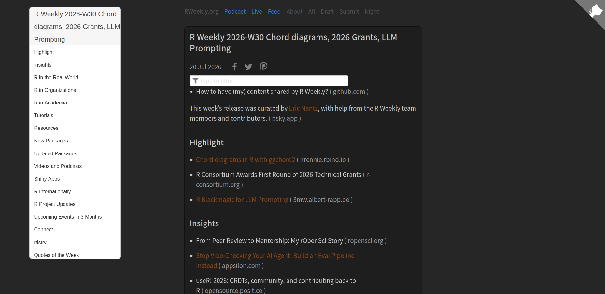
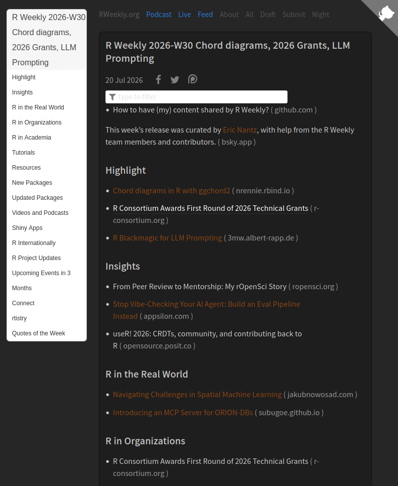
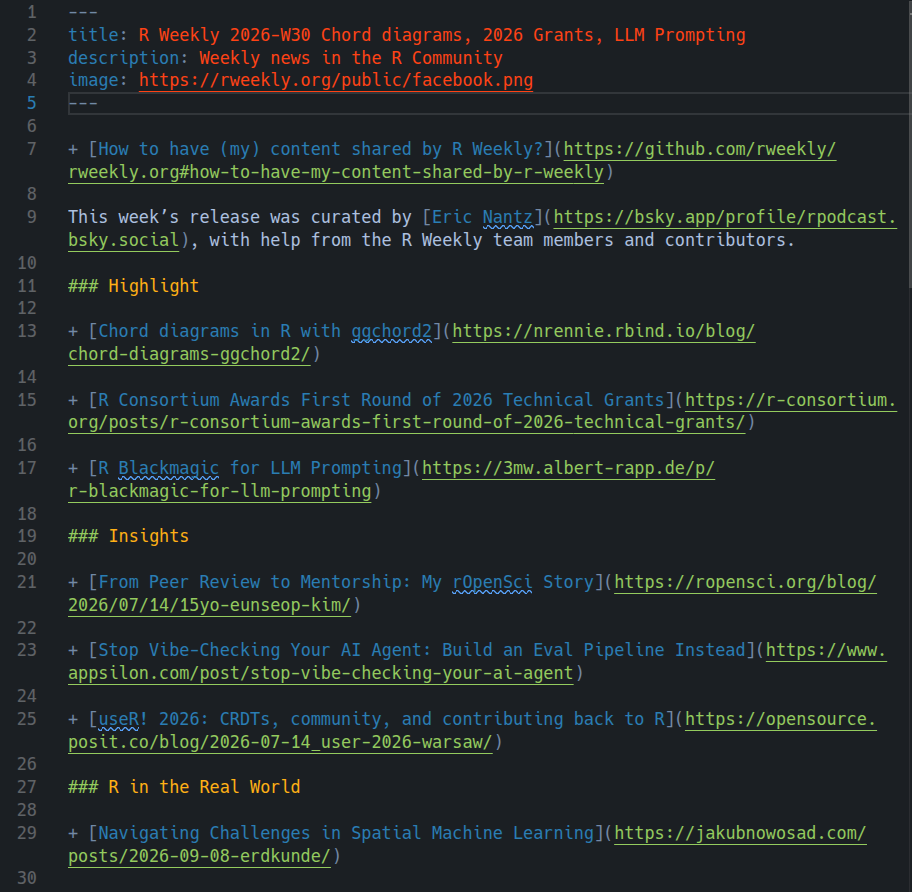
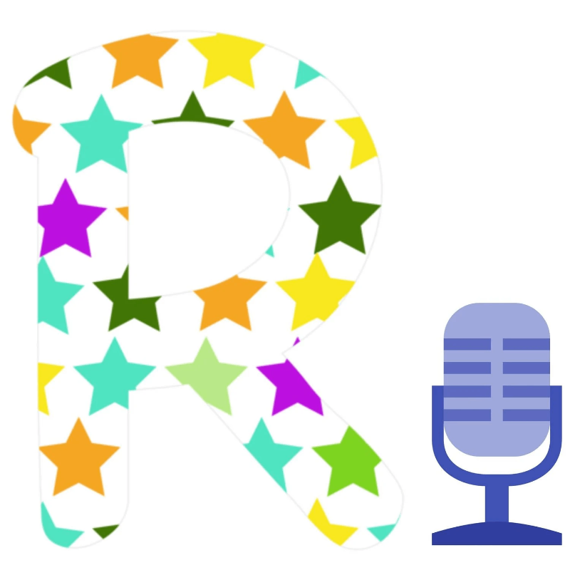
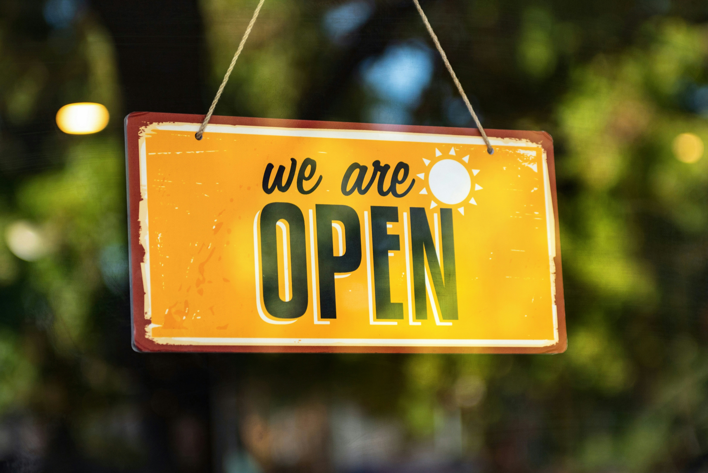
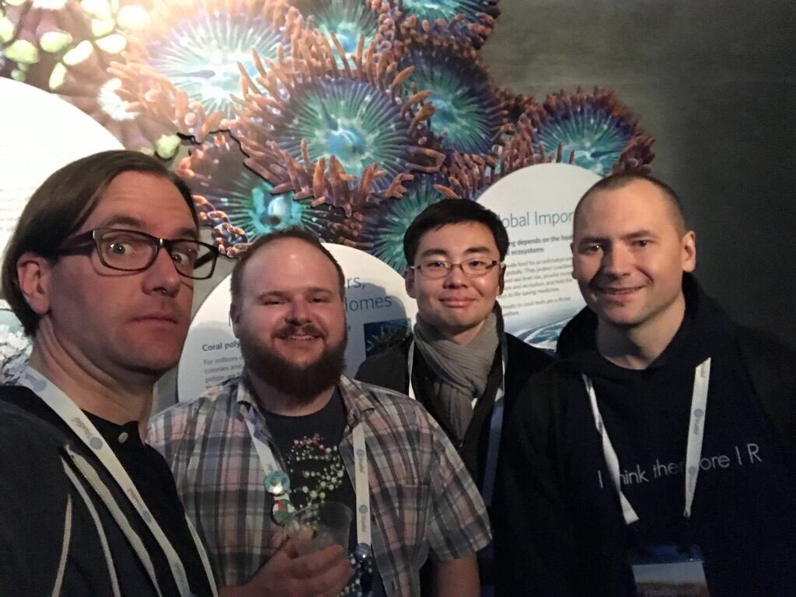

---
format:
  revealjs:
    auto-play-media: true
    width: 1280
    height: 720
    link-external-newwindow: true
    menu: true
    code-line-numbers: false
    echo: false
    pagetitle: Journey of R Weekly
    theme: [dark, styles.scss]
    footer: "[rpodcast.github.io/rweekly-positconf2026](https://rpodcast.github.io/rweekly-positconf2026/)"
resources:
  - "assets/img/contributor_globe.html"
---

```{r}
#| label: setup
#| include: false

# load supporting scripts
source("scripts/rweekly_theme.R")
```

## {#titleslide data-menu-title="Title Slide" background-image="assets/img/title_slide_background.png" background-size="cover" background-position="center"}

<h2>For the community, by the community</h2>

<h4>The 10-year journey of R Weekly powered by open-source</h4>

<h4>`posit::conf(2026)`</h4>

Eric Nantz

Statistician / Developer / Podcaster

Eli Lilly & Company

[ [\@rpodcast](https://podcastindex.org/@rpodcast) &nbsp;  [\@rpodcast](https://bsky.app/profile/rpodcast.bsky.social) &nbsp;  [eric-nantz](https://www.linkedin.com/in/eric-nantz-6621617/)]{style="font-size: 0.6em"}

## {background-image="assets/img/sharing.png" footer=false}

## 2016: R Weekly Arrives!



::: {.notes}
* Weekly collection of latest R news and resources
* Combination of RSS site feeds and individual resources
* R Weekly Team composed of volunteers passionate about the R community
* Highlights voted on by team before issue release
* Entire project is open-source
:::

::: footer
[rweekly.org](https://rweekly.org)
:::

---

::: {.columns}

::: {.column width="45%"}



:::

::: {.column width="55%" .fragment}



:::

:::


## 2020: R Weekly Highlights Podcast!

::: {.columns}

::: {.column width="40%"}

* Conversations centered on issue highlights
* Community drives the content!

:::

::: {.column width="60%"}

```{=html}
<div style="display: flex; align-items: center; justify-content: center; gap: 1rem;">
  
  
  
</div>
```

:::

:::

::: footer
[serve.podhome.fm/r-weekly-highlights](https://serve.podhome.fm/r-weekly-highlights)
:::

## Behind the Site {visibility="hidden"}

* Markdown files composed with Jekyll static-site generator
* Curator communication and polls on Slack
* GitHub for version control and automation
* Shiny app for Highlights poll generation
* Quarto Dashboard for curator calendar

## Merged Pull Requests to R Weekly

```{r}
#| label: year-pr-plot-before-uncertainty
#| fig-width: 10
#| fig-height: 5.5
#| fig-align: center
#| dev.args: !expr list(bg = "transparent")

library(dplyr)
library(ggplot2)
library(scales)

cadence_yearly_early <- readr::read_csv("data/cadence_yearly.csv", show_col_types = FALSE) |>
  #filter(year >= 2016, year <= 2021) |>
  arrange(year)

ggplot(cadence_yearly_early, aes(x = year, y = merged_prs)) +
  geom_col(fill = rweekly_colors$teal, width = 0.7) +
  geom_text(
    aes(label = comma(merged_prs)),
    vjust = -0.6,
    color = rweekly_colors$text,
    size  = 3.6
  ) +
  scale_x_continuous(breaks = cadence_yearly_early$year) +
  scale_y_continuous(
    labels = comma,
    expand = expansion(mult = c(0, 0.15))
  ) +
  labs(
    x = NULL,
    y = NULL
  ) +
  theme_rweekly()
```

## First-time Contributors

```{r}
#| label: yearly-first-time-contributor-percent-plot
#| fig-width: 10
#| fig-height: 5.5
#| fig-align: center
#| dev.args: !expr list(bg = "transparent")

library(dplyr)
library(ggplot2)
library(scales)

first_time_yearly <- readr::read_csv(
  "data/first_time_contributors_by_year.csv",
  show_col_types = FALSE
) |>
  arrange(year)

avg_pct <- round(mean(first_time_yearly$pct_prs_from_first_time), 1)

ggplot(first_time_yearly, aes(x = year, y = pct_prs_from_first_time)) +
  # geom_hline(
  #   yintercept = avg_pct,
  #   linetype   = "dashed",
  #   color      = rweekly_colors$muted,
  #   linewidth  = 0.4
  # ) +
  # annotate(
  #   "text",
  #   x = min(first_time_yearly$year),
  #   y = avg_pct,
  #   label = paste0("mean: ", avg_pct, "%"),
  #   hjust = 0, vjust = -0.5,
  #   color = rweekly_colors$muted,
  #   size  = 3.4
  # ) +
  geom_col(fill = rweekly_colors$teal, width = 0.7) +
  geom_text(
    aes(label = paste0(pct_prs_from_first_time, "%")),
    vjust = -0.6,
    color = rweekly_colors$text,
    size  = 3.6
  ) +
  scale_x_continuous(breaks = first_time_yearly$year) +
  scale_y_continuous(
    labels = label_percent(scale = 1),
    expand = expansion(mult = c(0, 0.15))
  ) +
  labs(
    x = NULL,
    y = NULL
  ) +
  theme_rweekly()
```

## Worldwide Contributors {#globe-static data-menu-title="Contributor globe"}

::: {.r-stretch}
{fig-alt="Two orthographic globes side by side. The left globe shows the Americas, Europe, and Africa with contributor markers over 26 countries; the right shows Asia and Oceania with markers over 8 countries. USA leads with 55 contributors."}
:::

::: {.notes}
R Weekly contributors span **34 countries** across every populated continent. Bubble size and colour scale with the number of unique contributors per country.
:::

## You Can Shape The Future

::: {.columns}

::: {.column width="50%"}



:::

::: {.column width="50%"}

* Share R Weekly across your networks.
* Contribute to an upcoming issue.
* Join our team!

{width="90%"}


:::

:::

## Thank You!

:::: {.columns}

::: {.column width=60%}

::: {style="font-size: 0.7em"}

📰 **R Weekly Site**: [rweekly.org](https://rweekly.org)

🎤 **R Weekly Highlights**: [serve.podhome.fm/r-weekly-highlights](https://serve.podhome.fm/r-weekly-highlights)

{width="80%"}

:::

:::

::: {.column width=40%}

::: {style="font-size: 0.7em"}

**Let's Connect!**

 [R-Podcast](https://r-podcast.org)

 [Shiny Developer Series](https://shinydevseries.com)

 [\@rpodcast](https://podcastindex.org/@rpodcast)

 [\@rpodcast](https://bsky.app/profile/rpodcast.bsky.social)

 [eric-nantz](https://www.linkedin.com/in/eric-nantz-6621617/)

 [rpodcast](https://github.com/rpodcast/)
:::

<br />



:::

::::

::: footer
R Weekly curators at rstudio::conf(2020)
:::