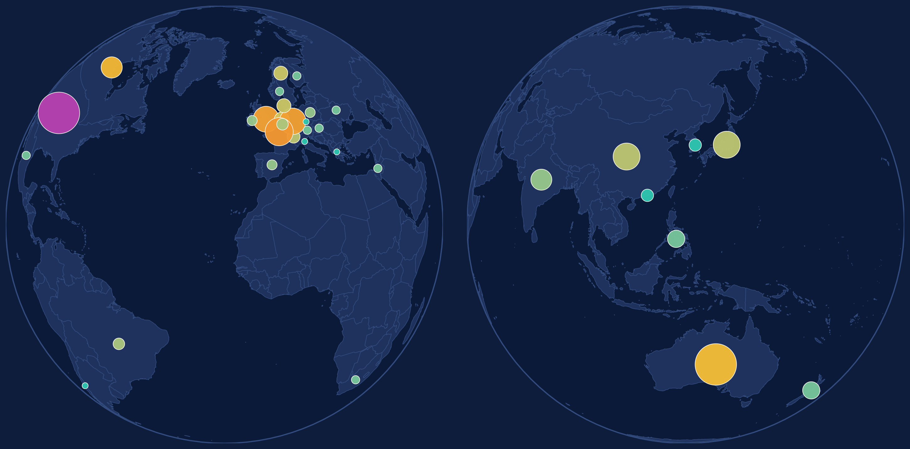

---
format:
  revealjs:
    auto-play-media: true
    width: 1280
    height: 720
    link-external-newwindow: true
    menu: true
    code-line-numbers: false
    echo: false
    pagetitle: Journey of R Weekly
    theme: [dark, styles.scss]
    footer: "[rpodcast.github.io/rweekly-positconf2026](https://rpodcast.github.io/rweekly-positconf2026/)"
resources:
  - "assets/img/contributor_globe.html"
---

## {#titleslide data-menu-title="Title Slide" background-image="assets/img/title_slide_background.png" background-size="cover" background-position="center"}

<h2>For the community, by the community</h2>

<h4>The 10-year journey of R Weekly powered by open-source</h4>

<h4>`posit::conf(2026)`</h4>

Eric Nantz

Statistician / Developer / Podcaster

Eli Lilly & Company

[ [\@rpodcast](https://podcastindex.org/@rpodcast) &nbsp;  [\@rpodcast](https://bsky.app/profile/rpodcast.bsky.social) &nbsp;  [eric-nantz](https://www.linkedin.com/in/eric-nantz-6621617/)]{style="font-size: 0.6em"}

## {#globe-static data-menu-title="Contributor globe"}

::: {.r-stretch}
{fig-alt="Two orthographic globes side by side. The left globe shows the Americas, Europe, and Africa with contributor markers over 26 countries; the right shows Asia and Oceania with markers over 8 countries. USA leads with 55 contributors."}
:::

::: {.notes}
R Weekly contributors span **34 countries** across every populated continent. Bubble size and colour scale with the number of unique contributors per country.
:::

## Spin the globe {visibility="hidden" #globe-interactive .globe-interactive-slide data-menu-title="3D contributor globe" background-iframe="assets/img/contributor_globe.html" background-interactive="true"}

::: {.absolute top="0" left="0" style="background: rgba(10,21,48,0.75); padding: 0.4em 0.8em; border-radius: 6px; font-size: 0.55em; max-width: 22em;"}
**406 contributors, 34 countries.**  
Bar height and colour = contributors per country. Drag to spin.
:::

## Thank You!

:::: {.columns}

::: {.column width=60%}

::: {style="font-size: 0.7em"}

📰 **R Weekly Site**:

[rweekly.org](https://rweekly.org)

🎤 **R Weekly Highlights Podcast**:

[serve.podhome.fm/r-weekly-highlights](https://serve.podhome.fm/r-weekly-highlights)

🏡 **Slides**: 

[rpodcast.github.io/rweekly-positconf2026](https://rpodcast.github.io/rweekly-positconf2026/)

:::

{width="20%"}

:::

::: {.column width=40%}

::: {style="font-size: 0.7em"}

**Let's Connect!**

 [R-Podcast](https://r-podcast.org)

 [Shiny Developer Series](https://shinydevseries.com)

 [\@rpodcast](https://podcastindex.org/@rpodcast)

 [\@rpodcast](https://bsky.app/profile/rpodcast.bsky.social)

 [eric-nantz](https://www.linkedin.com/in/eric-nantz-6621617/)

 [rpodcast](https://github.com/rpodcast/)
:::

:::

::::

